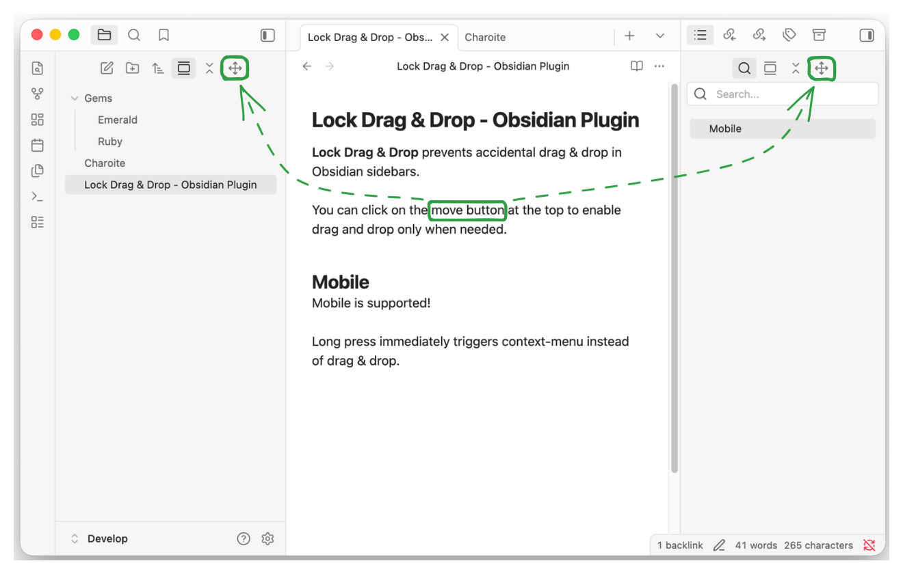

# Lock Drag & Drop - Obsidian Plugin

<b>Lock Drag & Drop</b> prevents accidental drag & drop in Obsidian sidebars.

You can click on the move button at the top to enable drag & drop only when needed.

On Mobile, long press immediately triggers context-menu instead of drag & drop.



## Development

Install dependencies and build the plugin:

```sh
pnpm install
pnpm run build
```

The build writes `main.js`, `manifest.json`, and `styles.css` to `./dist/`.

Then symlink the `./dist/` folder from the Obsidian plugin folder. 
```sh
ln -s <path to ./dist/> obsidian-lock-drag-and-drop
```

If you want to sync your plugins, you will need to copy the folder instead of symlinking.


### Creating a release

1. Update the version number in package.json and manifest.json
2. Update versions.json using `pnpm version`
3. Run below command to create and upload new version tag

```
git tag -a 1.0.0 -m "1.0.0"
git push origin main 1.0.0
```

## Disclaimer

This plugin was developed with AI assistance, but all code was manually reviewed by a human.

This plugin is not affiliated with official Obsidian product.
